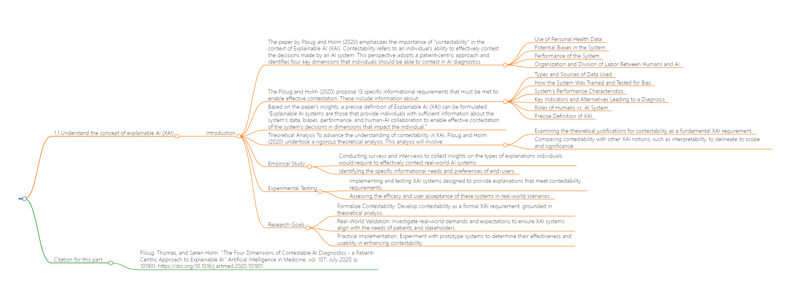
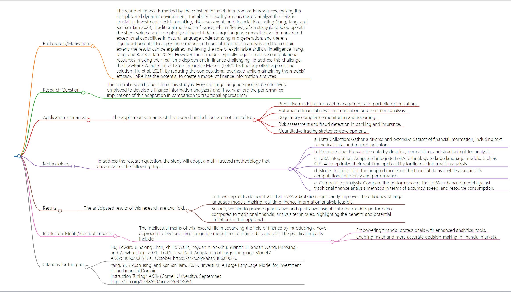

# Literature
## 1.1 Understand the concept of explainable AI (XAI)
### Introduction
#### The paper by Ploug and Holm (2020) emphasizes the importance of "contestability" in the context of Explainable AI (XAI). Contestability refers to an individual's ability to effectively contest the decisions made by an AI system. This perspective adopts a patient-centric approach and identifies four key dimensions that individuals should be able to contest in AI diagnostics:
- Use of Personal Health Data
- Potential Biases in the System
- Performance of the System
- Organization and Division of Labor Between Humans and AI
#### The Ploug and Holm (2020) propose 13 specific informational requirements that must be met to enable effective contestation. These include information about:
- Types and Sources of Data Used
- How the System Was Trained and Tested for Bias
- System's Performance Characteristics
- Key Indicators and Alternatives Leading to a Diagnosis
- Roles of Humans vs. AI System
- Precise Definition of XAI
#### Based on the paper's insights, a precise definition of Explainable AI (XAI) can be formulated: "Explainable AI systems are those that provide individuals with sufficient information about the system's data, biases, performance, and human-AI collaboration to enable effective contestation of the system's decisions in dimensions that impact the individual."
#### Theoretical Analysis To advance the understanding of contestability in XAI, Ploug and Holm (2020) undertook a rigorous theoretical analysis. This analysis will involve:
- Examining the theoretical justifications for contestability as a fundamental XAI requirement.
- Comparing contestability with other XAI notions, such as interpretability, to delineate its scope and significance.
#### Empirical Study:
The research includes empirical investigations to ascertain the real-world demands of patients and stakeholders regarding XAI explanations. This will involve:
- Conducting surveys and interviews to collect insights on the types of explanations individuals would require to effectively contest real-world AI systems.
- Identifying the specific informational needs and preferences of end-users.
#### Experimental Testing
To practically implement and evaluate the concept of contestability, we will develop prototype XAI systems that aim to enhance contestability. Ploug and Holm (2020) experimental approach includes:
- Implementing and testing XAI systems designed to provide explanations that meet contestability requirements.
- Assessing the efficacy and user acceptance of these systems in real-world scenarios.
#### Research Goals
Ploug and Holm (2020) multifaceted research program aims to achieve the following objectives:
- Formalize Contestability: Develop contestability as a formal XAI requirement, grounded in theoretical analysis.
- Real-World Validation: Investigate real-world demands and expectations to ensure XAI systems align with the needs of patients and stakeholders.
- Practical Implementation: Experiment with prototype systems to determine their effectiveness and usability in enhancing contestability.

## Citation for this part：
- Ploug, Thomas, and Søren Holm. “The Four Dimensions of Contestable AI Diagnostics - a Patient-Centric Approach to Explainable AI.” Artificial Intelligence in Medicine, vol. 107, July 2020, p. 101901, https://doi.org/10.1016/j.artmed.2020.101901.

## Flowchart

# 1.2 Identify Research Ideas at the Frontiers of XAI:
## Background/Motivation:
- The world of finance is marked by the constant influx of data from various sources, making it a complex and dynamic environment. The ability to swiftly and accurately analyze this data is crucial for investment decision-making, risk assessment, and financial forecasting (Yang, Tang, and Kar Yan Tam 2023). Traditional methods in finance, while effective, often struggle to keep up with the sheer volume and complexity of financial data. Large language models have demonstrated exceptional capabilities in natural language understanding and generation, and there is significant potential to apply these models to financial information analysis and to a certain extent, the results can be explained, achieving the role of explainable artificial intelligence (Yang, Tang, and Kar Yan Tam 2023). However, these models typically require massive computational resources, making their real-time deployment in finance challenging. To address this challenge, the Low-Rank Adaptation of Large Language Models (LoRA) technology offers a promising solution (Hu et al. 2021). By reducing the computational overhead while maintaining the models' efficacy, LoRA has the potential to create a model of finance information analyzer.

## Research Question:
- The central research question of this study is: How can large language models be effectively employed to develop a finance information analyzer? and if so, what are the performance implications of this adaptation in comparison to traditional approaches?

## Application Scenarios:
### The application scenarios of this research include but are not limited to:
- Predictive modeling for asset management and portfolio optimization.
- Automated financial news summarization and sentiment analysis.
- Regulatory compliance monitoring and reporting.
- Risk assessment and fraud detection in banking and insurance.
- Quantitative trading strategies development.
## Methodology:
### To address the research question, the study will adopt a multi-faceted methodology that encompasses the following steps:
- a. Data Collection: Gather a diverse and extensive dataset of financial information, including text, numerical data, and market indicators.
- b. Preprocessing: Prepare the data by cleaning, normalizing, and structuring it for analysis.
- c. LoRA Integration: Adapt and integrate LoRA technology to large language models, such as GPT-4, to optimize their real-time applicability for finance information analysis. 
- d. Model Training: Train the adapted model on the financial dataset while assessing its computational efficiency and performance.
- e. Comparative Analysis: Compare the performance of the LoRA-enhanced model against traditional finance analysis methods in terms of accuracy, speed, and resource consumption.
## Results:
### The anticipated results of this research are two-fold. 
- First, we expect to demonstrate that LoRA adaptation significantly improves the efficiency of large language models, making real-time finance information analysis feasible. 
- Second, we aim to provide quantitative and qualitative insights into the model's performance compared to traditional financial analysis techniques, highlighting the benefits and potential limitations of this approach.
## Intellectual Merits/Practical Impacts:
### The intellectual merits of this research lie in advancing the field of finance by introducing a novel approach to leverage large language models for real-time data analysis. The practical impacts include:
- Empowering financial professionals with enhanced analytical tools.
- Enabling faster and more accurate decision-making in financial markets.
## Citations for this part
- Hu, Edward J., Yelong Shen, Phillip Wallis, Zeyuan Allen-Zhu, Yuanzhi Li, Shean Wang, Lu Wang, and Weizhu Chen. 2021. “LoRA: Low-Rank Adaptation of Large Language Models.” ArXiv:2106.09685 [Cs], October. https://arxiv.org/abs/2106.09685.
- Yang, Yi, Yixuan Tang, and Kar Yan Tam. 2023. “InvestLM: A Large Language Model for Investment Using Financial Domain
  Instruction Tuning.” ArXiv (Cornell University), September. https://doi.org/10.48550/arxiv.2309.13064.
## Flowchart


# Citations
```
@article{ploug2020four,
  title={The four dimensions of contestable AI diagnostics-A patient-centric approach to explainable AI},
  author={Ploug, Thomas and Holm, S{\o}ren},
  journal={Artificial Intelligence in Medicine},
  volume={107},
  pages={101901},
  year={2020},
  publisher={Elsevier}
}

@inproceedings{
hu2022lora,
title={Lo{RA}: Low-Rank Adaptation of Large Language Models},
author={Edward J Hu and Yelong Shen and Phillip Wallis and Zeyuan Allen-Zhu and Yuanzhi Li and Shean Wang and Lu Wang and Weizhu Chen},
booktitle={International Conference on Learning Representations},
year={2022},
url={https://openreview.net/forum?id=nZeVKeeFYf9}
}

@misc{yang2023investlm,
      title={InvestLM: A Large Language Model for Investment using Financial Domain Instruction Tuning}, 
      author={Yi Yang and Yixuan Tang and Kar Yan Tam},
      year={2023},
      eprint={2309.13064},
      archivePrefix={arXiv},
      primaryClass={q-fin.GN}
}
```
