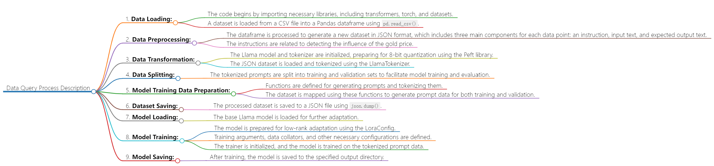

# Code
- The code first imports necessary libraries like transformers, torch, and datasets. It then loads a dataset from a CSV file into a Pandas dataframe. The dataframe is processed to generate a new dataset in JSON format, with each data point containing an instruction, input text, and expected output text. The Llama model and tokenizer are initialized and prepared for 8-bit quantization using the Peft library. The JSON dataset is loaded and tokenized. The tokenized prompts are split into train and validation sets. The model is prepared for low-rank adaptation with the LoraConfig. Training arguments are defined and the model is compiled before being trained on the tokenized prompt data. In summary, the code loads a dataset, processes and tokenizes it, and then trains a quantized Llama model on the tokenized data using low-rank adaptation provided by Peft.
## Flowchart

## Pseudo-code
```
# Install required packages
install_package("pip", "-U pip")
install_package("pip", "accelerate==0.18.0")
install_package("pip", "appdirs==1.4.4")
install_package("pip", "bitsandbytes==0.37.2")
install_package("pip", "datasets==2.10.1")
install_package("pip", "fire==0.5.0")
install_package("pip", "git+https://github.com/huggingface/peft.git")
install_package("pip", "git+https://github.com/huggingface/transformers.git")
install_package("pip", "torch==2.0.0")
install_package("pip", "sentencepiece==0.1.97")
install_package("pip", "tensorboardX==2.6")
install_package("pip", "gradio==3.23.0")

# Import libraries
import transformers
import textwrap
from transformers import LlamaTokenizer, LlamaForCausalLM
import os
import sys
from typing import List
from peft import (
    LoraConfig,
    get_peft_model,
    get_peft_model_state_dict,
    prepare_model_for_int8_training,
)
import fire
import torch
from datasets import load_dataset
import pandas as pd
import matplotlib.pyplot as plt
import matplotlib as mpl
import seaborn as sns
from pylab import rcParams

# Set up plotting parameters
sns.set(rc={'figure.figsize':(10, 7)})
sns.set(rc={'figure.dpi':100})
sns.set(style='white', palette='muted', font_scale=1.2)

# Check and set the device
DEVICE = "cuda" if torch.cuda.is_available() else "cpu"

# Read data from CSV file
df = pd.read_csv("data.csv", engine='python', sep=None)
df.head()
print(len(df.News))

# Prepare dataset for model training
dataset_data = []
temp1 = len(df.Date)
for i in range(0, temp1):
    temp2 = ""
    if df.scores[i] > 0.75:
        temp2 = "Highly possibility the price will have a "
    elif df.scores[i] > 0.5:
        temp2 = "Middle possibility the price will have a "
    else:
        temp2 = "Low possibility the price will have a "
    temp2 += df.result[i]
    temp2 += " change"
    dataset_data.append({"instruction": "Detect the influence of price.",
                         "input": df.News[i],
                         "output": temp2})

# Save dataset to JSON file
import json
with open("dataset.json", "w") as f:
    json.dump(dataset_data, f)

# Load base model
BASE_MODEL = "decapoda-research/llama-7b-hf"
model = LlamaForCausalLM.from_pretrained(
    BASE_MODEL,
    load_in_8bit=True,
    torch_dtype=torch.float16,
    device_map="auto",
)

# Tokenize data
tokenizer = LlamaTokenizer.from_pretrained(BASE_MODEL)
# ... (Code for tokenizing data)

# Define functions for model training
def generate_prompt(data_point):
    # ... (Code for generating prompt)

def tokenize(prompt, add_eos_token=True):
    # ... (Code for tokenizing prompt)

def generate_and_tokenize_prompt(data_point):
    # ... (Code for generating and tokenizing prompt)

# Split data into training and validation sets
train_val = data["train"].train_test_split(
    test_size=200, shuffle=True, seed=42
)
train_data = (
    train_val["train"].map(generate_and_tokenize_prompt)
)
val_data = (
    train_val["test"].map(generate_and_tokenize_prompt)
)

# Set hyperparameters
# ... (Define hyperparameters)

# Prepare model for training
model = prepare_model_for_int8_training(model)
config = LoraConfig(
    r=LORA_R,
    lora_alpha=LORA_ALPHA,
    target_modules=LORA_TARGET_MODULES,
    lora_dropout=LORA_DROPOUT,
    bias="none",
    task_type="CAUSAL_LM",
)
model = get_peft_model(model, config)
model.print_trainable_parameters()

# Set training arguments
training_arguments = transformers.TrainingArguments(
    per_device_train_batch_size=MICRO_BATCH_SIZE,
    # ... (Define other training arguments)
)

# Define data collator
data_collator = transformers.DataCollatorForSeq2Seq(
    tokenizer, pad_to_multiple_of=8, return_tensors="pt", padding=True
)

# Initialize trainer
trainer = transformers.Trainer(
    model=model,
    train_dataset=train_data,
    eval_dataset=val_data,
    args=training_arguments,
    data_collator=data_collator
)

# Disable caching for model
model.config.use_cache = False
old_state_dict = model.state_dict
model.state_dict = (
    lambda self, *_, **__: get_peft_model_state_dict(
        self, old_state_dict()
    )
).__get__(model, type(model))

# Compile and train the model
model = torch.compile(model)
trainer.train()
model.save_pretrained(OUTPUT_DIR)

```