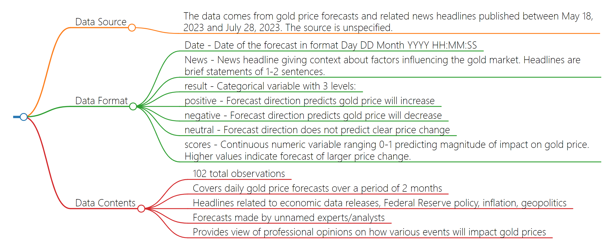

# Data
- The data is a time series of gold price forecasts and related news headlines from May 18, 2023 to July 28, 2023. It contains the date, news headline, predicted direction of the gold price (positive, negative, or neutral), and a score predicting the impact on the gold price. The headlines provide context on factors influencing the gold market like US economic data, Federal Reserve policy, inflation, and geopolitics. The predictions aim to forecast if these events will cause the gold price to rise, fall, or remain steady. Overall, the data gives a snapshot of expert analysis on gold price movements over a 2-month period.
# Data dictionary

| **Variable** 	|                              **Description**                              	|
|:------------:	|:-------------------------------------------------------------------------:	|
|     Date     	|                      Date of the gold price forecast.                     	|
|     News     	|             News headline providing context on market factors.            	|
|    result    	| Predicted direction of gold price change: positive, negative, or neutral. 	|
|    scores    	|        Numeric score predicting magnitude of impact on gold price.        	|
# Flowchart
